# Honey Money

Expense Management App

## Demo video
https://www.youtube.com/watch?v=I0H54yfZBN4

## Technologies used

- Language : Javascript

- FrameWork : React Native 0.64

- Database: Firebase

* expo - https://github.com/expo/expo

* react-native - https://github.com/facebook/react-native

* react-navigation - https://github.com/react-navigation/react-navigation

* redux - https://github.com/reduxjs/redux

* react-redux - https://github.com/reduxjs/react-redux

* @react-native-firebase - https://github.com/invertase/react-native-firebase/tree/master
* ...

## Nội dung

1. [Chức năng](#chức-năng)

   1. [Đăng nhập / Đăng kí](#đăng-nhập-/-đăng-kí)
   1. [Quản lý giao dịch](#quản-lý-giao-dịch)
   1. [Quản lý danh mục](#quản-lý-danh-mục)
   1. [Quản lý ví](#quản-lý-ví)
   1. [Xem báo cáo, thống kê](#xem-báo-cáo,-thống-kê)
   1. [Quản lý hạn mức](#quản-lý-hạn-mức)
   1. [Thông báo](#thông-báo)
   1. [Quản lý thông tin tài khoản](#quản-lý-thông-tin-tài-khoản)
   1. [Công cụ tính toán](#công-cụ-tính-toán)

1. [Yêu cầu thiết bị](#yêu-cầu-thiết-bị)

1. [Thư viện và công nghệ](#thư-viện-và-công-nghệ)

1. [Tác giả](#tác-giả)

1. [Giấy phép](#giấy-phép)

## Chức năng

### Đăng nhập / Đăng kí

- Đăng nhập
- Đăng kí

  

    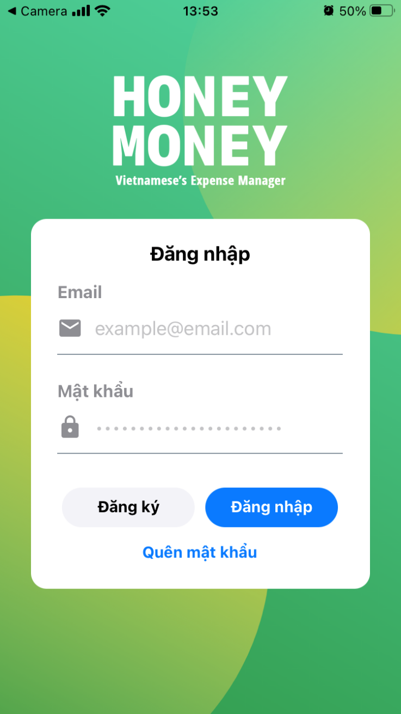
    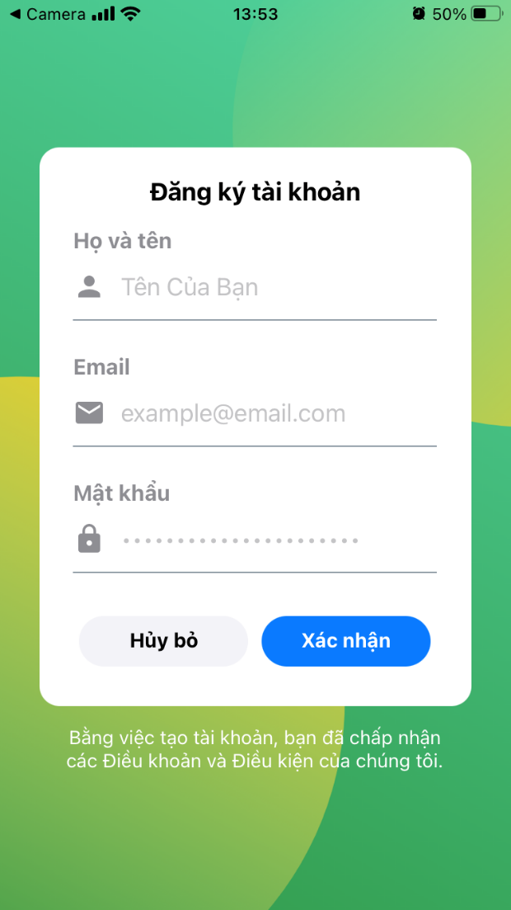
  

### Quản lý giao dịch

- Thêm/sửa/xóa giao dịch thu
- Thêm/sửa/xóa giao dịch chi
- Xem lịch sử giao dịch

  
  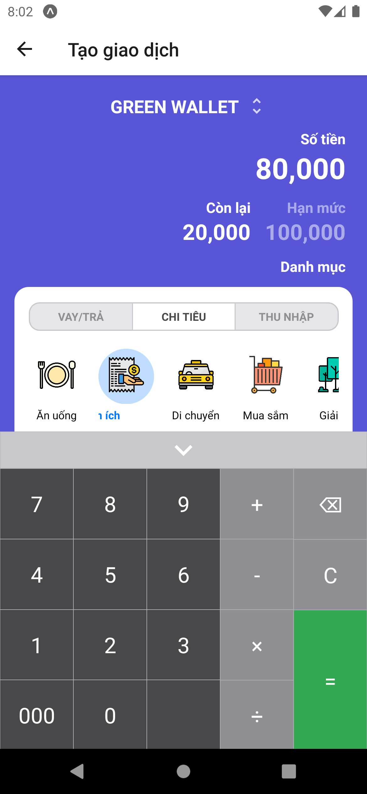
	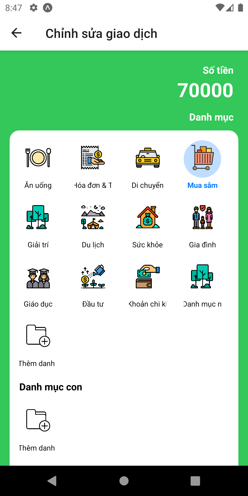

### Quản lý danh mục

- Thêm/sửa/xóa danh mục cha
- Thêm/sửa/xóa danh mục con

  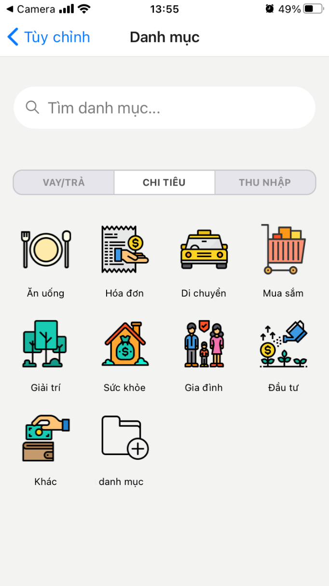 
   

### Quản lý ví

- Thêm/sửa/xóa ví
- Tạo giao dịch chuyển tiền giữa các ví

  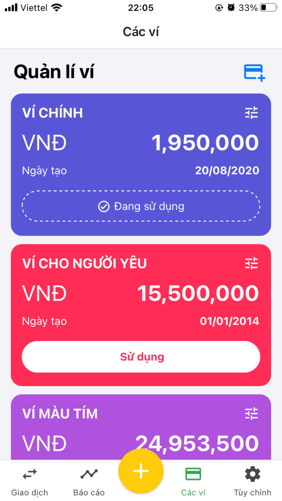 
  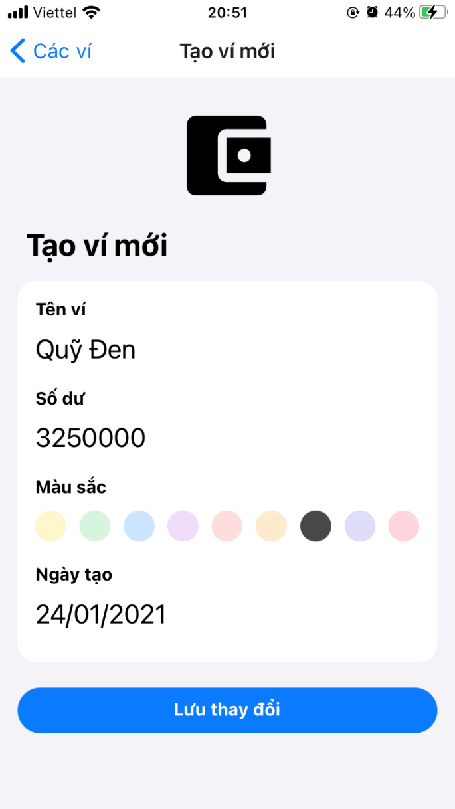 

### Xem báo cáo, thống kê

- Xem báo cáo thu chi theo tuần
- Xem báo cáo thu chi theo danh mục

  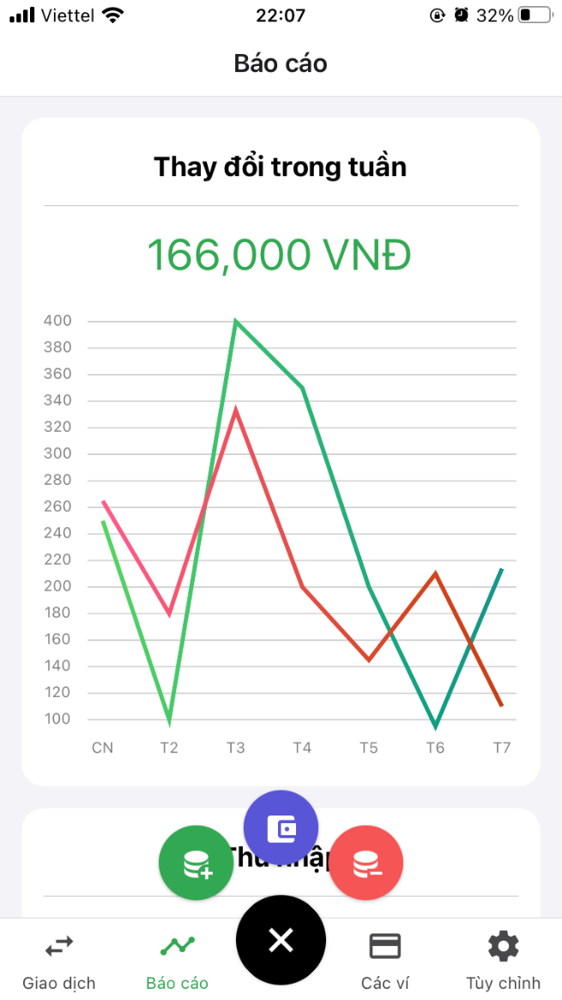 
  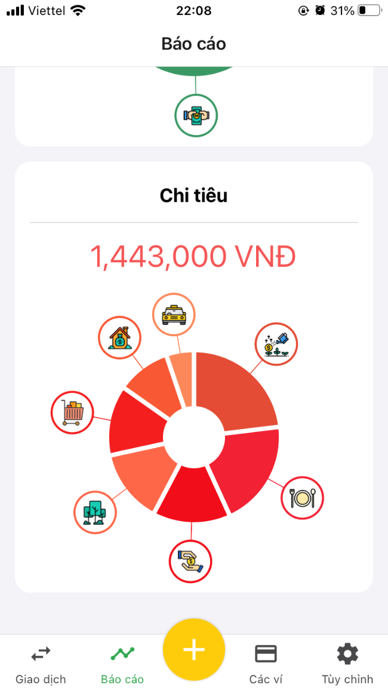 

### Quản lý hạn mức

- Thêm/sửa/xóa hạn mức

  

    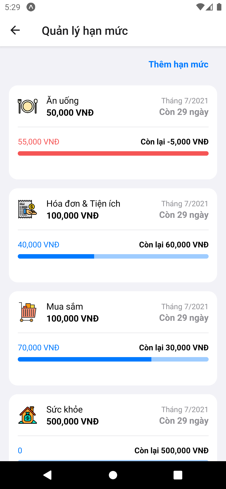
    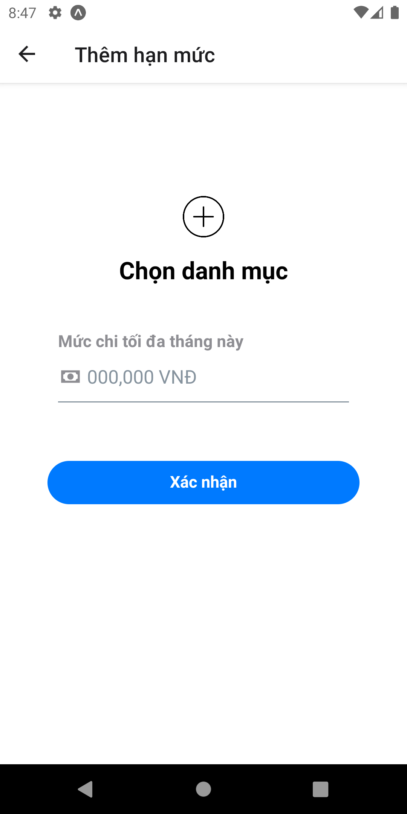
    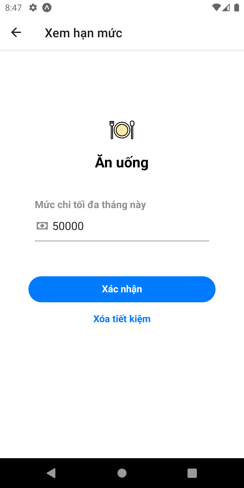
  

### Thông báo

- Cài đặt thời gian nhắc nhở cập nhật các giao dịch thu chi trong ngày.

  

    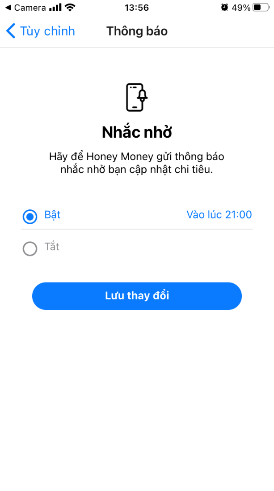 
  

### Quản lý thông tin tài khoản

- Sửa tên tài khoản người dùng
- Đổi mật khẩu

   
  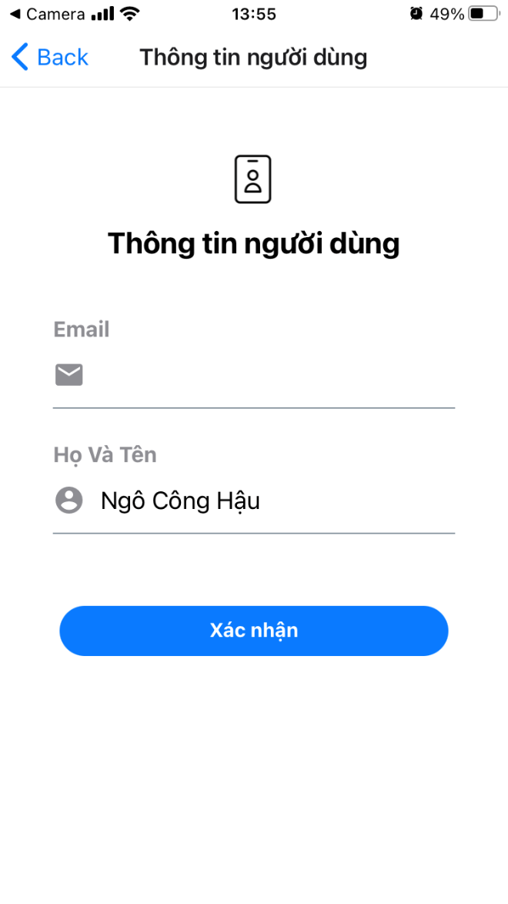
  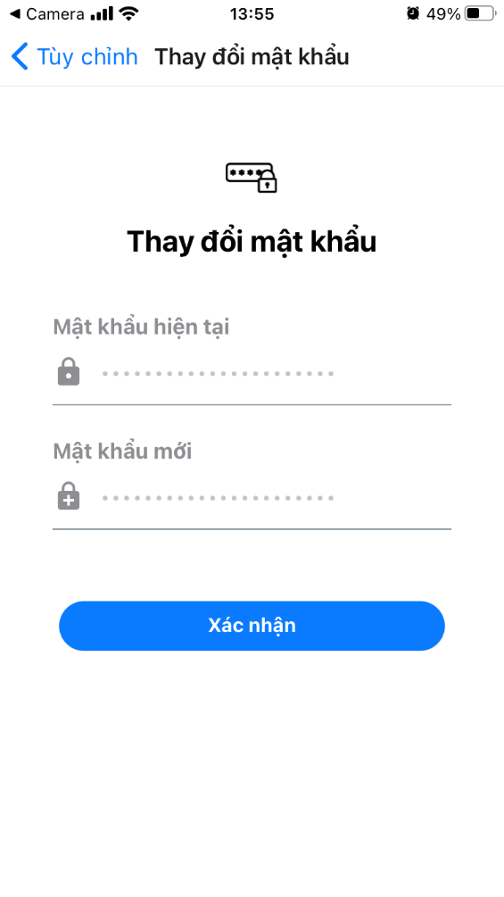

### Công cụ tính toán

- Chuyển đổi ngoại tệ
- Tính lãi suất

  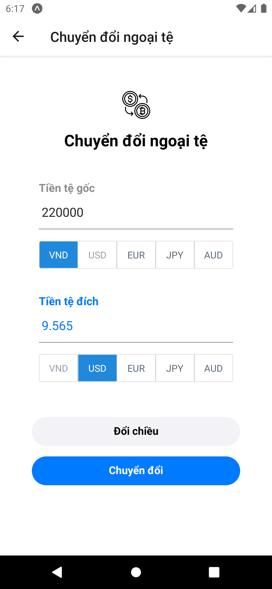 
  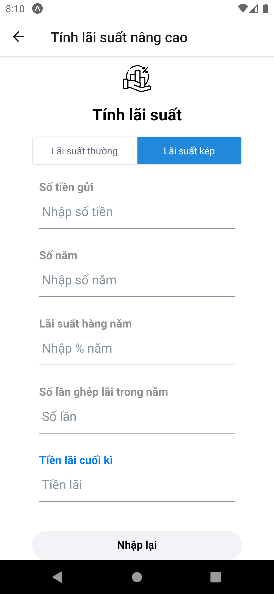
  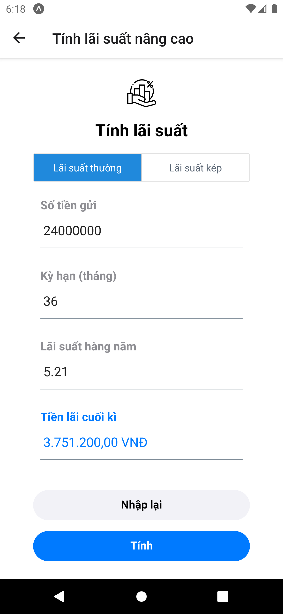

## Yêu cầu thiết bị

- Android:

  +Android studio : 3.0.1

  +Gradle : 4.1

  +Min sdk : 19

  +Target sdk : 26

- iOS:

  +iOS: 8.0

## Database

  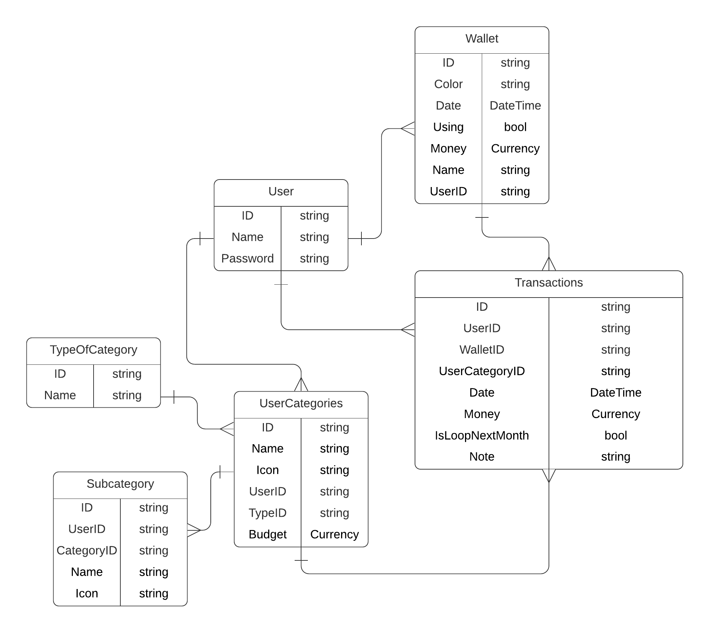 

## Tác giả

Phan Huy Tiến - 18520167@gm.uit.edu.vn

Ngô Công Hậu - 18520277@gm.uit.edu.vn

Lương Lý Công Thắng - 18520357@gm.uit.edu.vn

## Giấy phép

    Copyright 2021

    Licensed under the Apache License, Version 2.0 (the "License");
    you may not use this file except in compliance with the License.
    You may obtain a copy of the License at

       http://www.apache.org/licenses/LICENSE-2.0

    Unless required by applicable law or agreed to in writing, software
    distributed under the License is distributed on an "AS IS" BASIS,
    WITHOUT WARRANTIES OR CONDITIONS OF ANY KIND, either express or implied.
    See the License for the specific language governing permissions and
    limitations under the License.
